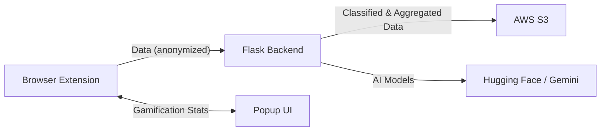
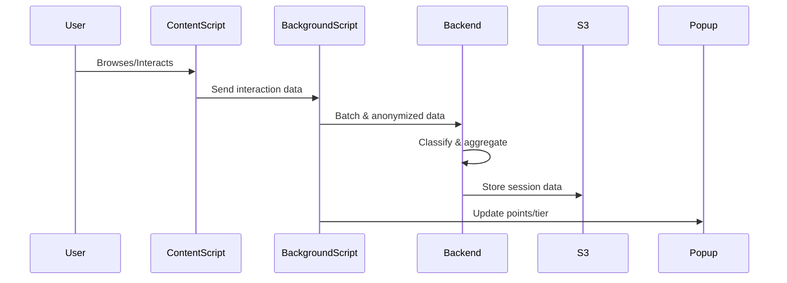

# Social Media Data Donation Extension

## Overview

**Social Media Data Donation** is an open-source browser extension and backend system that enables users to voluntarily and anonymously donate their social media interaction data from Instagram and X (Twitter). The project aims to help researchers and data scientists understand user engagement patterns, content trends, and platform dynamics, while prioritizing user privacy and transparency.

---

## Table of Contents

- [How It Works](#how-it-works)
- [Features](#features)
- [Tech Stack](#tech-stack)
- [Architecture & Workflow](#architecture--workflow)
- [Key Facts](#key-facts)
- [Diagrams](#diagrams)
- [Things That Can Be Improved](#things-that-can-be-improved)
- [Getting Started](#getting-started)
- [Contributing](#contributing)
- [License](#license)

---

## How It Works

1. **User installs the browser extension** (Chrome/Edge/Brave).
2. **Extension injects content scripts** into Instagram and X (Twitter) pages.
3. **User interactions** (views, likes, comments, shares, time spent, etc.) are detected in real time using DOM observers.
4. **Data is anonymized** in the background script, batched, and sent to a Python backend.
5. **Backend classifies content topics** using AI models (Hugging Face, Google Gemini), aggregates data by session, and stores it in AWS S3.
6. **Gamification**: Users earn points and tiers for their contributions, visible in the extension popup.

---

## Features

- **Multi-Platform Support**: Tracks Instagram and X (Twitter) interactions.
- **Anonymized Data Collection**: No personal identifiers are stored.
- **Rich Interaction Tracking**: Views, likes, comments, shares, time spent, media engagement, etc.
- **Content Classification**: Uses AI to classify post topics (zero-shot, image classification).
- **Session-Based Aggregation**: Data is grouped by session for richer analytics.
- **Gamification**: Points and tier system to encourage participation.
- **User Consent & Privacy**: Data collection is opt-in and transparent.
- **Robust Error Handling**: Handles SPA navigation, network errors, and browser quirks.
- **Scalable Backend**: Asynchronous processing, AWS S3 storage, and extensible architecture.

---

## Tech Stack

- **Frontend (Extension)**
  - JavaScript (ES6+)
  - Chrome Extension APIs (Manifest V3)
  - DOM APIs (MutationObserver, IntersectionObserver)
  - HTML/CSS for popup UI

- **Backend**
  - Python 3
  - Flask (REST API)
  - ThreadPoolExecutor (async processing)
  - Hugging Face Transformers (zero-shot classification)
  - Google Gemini Vision API (image classification)
  - AWS S3 (data storage)
  - Docker (optional, for deployment)

---

## Architecture & Workflow

### High-Level Workflow

```
User Browses Instagram/X → Content Script Observes Interactions → Background Script Anonymizes & Buffers Data → Batch Sent to Backend API → Backend Classifies & Aggregates Data → Data Stored in AWS S3 → Gamification: Points & Tiers Updated → Popup UI Shows Progress
```

### Detailed Steps

1. **Content Script**  
   - Detects posts, tracks views, likes, comments, shares, and time spent.
   - Handles SPA navigation and dynamic content loading.

2. **Background Script**  
   - Buffers and anonymizes data.
   - Adds session IDs, timestamps, and hashes user agent.
   - Implements points and tier logic.
   - Syncs data to backend in small batches.

3. **Backend (Flask API)**
   - Receives data batches.
   - Classifies text with Hugging Face zero-shot models.
   - Classifies images with Google Gemini Vision API.
   - Aggregates data by session and stores in AWS S3.

4. **Gamification**
   - Points awarded for each interaction.
   - Tier (level) increases every 100 points.
   - Stats are shown in the extension popup.

---

## Key Facts

- **Privacy-First**: No usernames, emails, or direct identifiers are ever stored.
- **Session-Based**: Data is grouped by session, not by user.
- **Extensible**: Easy to add new platforms, interaction types, or analytics.
- **Open Source**: All code is available for review and contribution.

---

## Diagrams

### System Architecture



### Extension Data Flow



---

## Things That Can Be Improved

- **UI/UX**: Add more visual feedback, badge icons, and progress bars in the popup.
- **More Gamification**: Add badges, streaks, and leaderboards.
- **User Data Export**: Let users export their own anonymized data.
- **More AI Models**: Use additional models for sentiment, toxicity, or trend detection.
- **Performance**: Optimize for very large data volumes or slow networks.
- **Mobile Support**: Extend to mobile browsers (if possible).
- **Automated Testing**: Add unit and integration tests for extension and backend.
- **Deployment**: Provide Docker Compose or cloud deployment scripts.

---

## Getting Started

### Prerequisites

- Node.js & npm (for extension development)
- Python 3.8+ (for backend)
- AWS account (for S3 storage)
- Hugging Face and Google Gemini API keys (for classification)

### Setup

#### 1. Extension
- Load the `extension/` folder as an unpacked extension in Chrome.
- Update `manifest.json` as needed.

#### 2. Backend
- Install dependencies:  
  `pip install -r backend/requirements.txt`
- Set environment variables for AWS and API keys.
- Run the backend:  
  `python backend/app.py`

#### 3. Connect Extension to Backend
- Ensure the backend URL in `background.js` matches your backend server.

---

## Contributing

Contributions are welcome! Please open issues or pull requests for bug fixes, new features, or documentation improvements.

---

## License

MIT License
